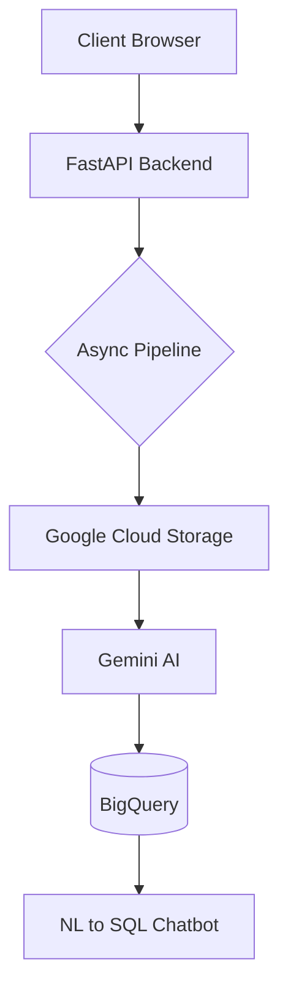

# Telecom Call Data Analyzer
AI-Powered Call Transcription, Analytics & Customer Support Insights

## Overview
This project is an async, cloud-native backend system designed for telecom customer support teams.
It ingests customer call recordings, converts them into structured data using an LLM, stores the results in BigQuery, and enables analytics and natural-language querying over historical call data.
The system is built with controlled LLM usage, strong validation boundaries, and human-in-the-loop safeguards to ensure data reliability.

## Key Capabilities
- Audio call ingestion (single & batch)
- Speech-to-text transcription using Gemini
- Structured extraction:
  - Complaint category
  - Sentiment
  - Resolution status
  - Call metadata
- Human-in-the-loop validation for single uploads
- Cost-efficient batch processing
- BigQuery-backed analytics storage
- Natural language → SQL analytics chatbot
- Operational metrics (throughput, latency, failures)

## System Architecture (High Level)


## Technology Stack
### Backend
- Python 3.10+
- FastAPI
- AsyncIO

### AI / NLP
- Gemini (audio transcription + reasoning)
- Prompt-controlled JSON extraction
- NL → SQL analytics

### Cloud
- Google Cloud Storage (temporary audio files)
- BigQuery (analytics warehouse)

### Frontend
- HTML / CSS / JavaScript
- Lightweight UI for validation & querying

## Project Structure
telecom-call-data-analyzer/
│
├── core/
│   ├── utils_core.py        # Async pipeline orchestration
│   ├── utils_gcs.py         # GCS upload & cleanup
│   ├── utils_gemini.py      # Gemini audio processing
│   ├── utils_bq.py          # BigQuery inserts
│   ├── query_utils.py       # NL → SQL chatbot logic
│   └── config.py            # Environment & client setup
│
├── frontend/
│   ├── index.html           # Call analyzer UI
│   └── chat.html            # Analytics chatbot UI
│
├── models.py                # Pydantic models & prompts
├── main.py                  # FastAPI entry point
├── requirements.txt
├── .env.example
├── .gitignore
└── README.md

## How the System Works
### 1. Single Call Upload (Human-in-the-Loop)
- User uploads a call recording
- Audio is uploaded to GCS temporarily
- Gemini extracts transcript and structured insights
- Results are shown to the user for review/edit
- User confirms → data is stored in BigQuery

### 2. Batch Upload (Automated)
- Folder of audio files is processed asynchronously
- Each file is analyzed independently
- Successful records are bulk-inserted into BigQuery
- Failures do not block the batch

### 3. Analytics Chatbot
- User asks a question in natural language
- Gemini generates SELECT-only SQL
- SQL is validated and executed on BigQuery
- Results are summarized into plain English

## How to Run Locally
### Prerequisites
- Python 3.10 or higher
- Google Cloud account
- Enabled APIs:
  - BigQuery
  - Cloud Storage
  - Vertex AI (Gemini)
- Service account with permissions:
  - BigQuery Data Editor
  - Storage Object Admin
  - Vertex AI User

**1. Clone the Repository**
```
git clone https://github.com/<your-username>/telecom-call-data-analyzer.git
cd telecom-call-data-analyzer
```
**2. Create Virtual Environment (Recommended)**
```
python -m venv venv
source venv/bin/activate        # Linux / Mac
venv\Scripts\activate           # Windows
```
**3. Install Dependencies**
```
pip install -r requirements.txt
```
**4. Configure Environment Variables**
Create a .env file using .env.example as reference:

**5. Authenticate with Google Cloud**
Set your service account credentials:
```
(Command Prompt)
export GOOGLE_APPLICATION_CREDENTIALS="path/to/service_account.json"
```
```
(Windows PowerShell)
setx GOOGLE_APPLICATION_CREDENTIALS "path\to\service_account.json"
```
**6. Run the Application**
```
uvicorn main:app --reload
```

**Open in browser:**
http://127.0.0.1:8000
 → Call Analyzer
http://127.0.0.1:8000/chat
 → Analytics Chatbot

### Design Principles
- LLMs are untrusted: all outputs are validated
- Human-in-the-loop for critical inserts
- Async-first for scalability
- Cost-aware BigQuery usage
- Fail-safe pipelines (no cascading failures)

### Future Improvements (Optional)
- Authentication & role-based access
- Dashboard-based analytics
- Streaming ingestion
- Multi-language support
- Deployment via Docker / Cloud Run

## Disclaimer
This project is intended for educational and portfolio purposes and demonstrates backend AI system design patterns for analytics and customer support use cases.

## Author
Omkar
Backend / AI Engineering Portfolio Project
